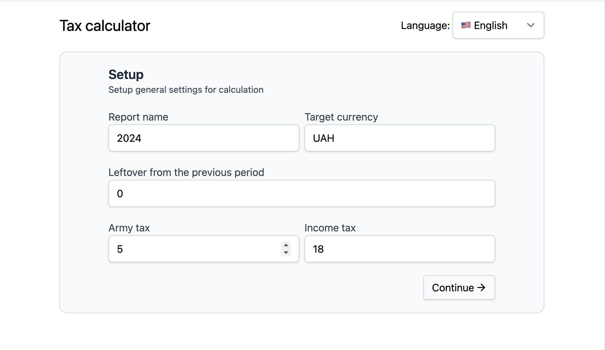
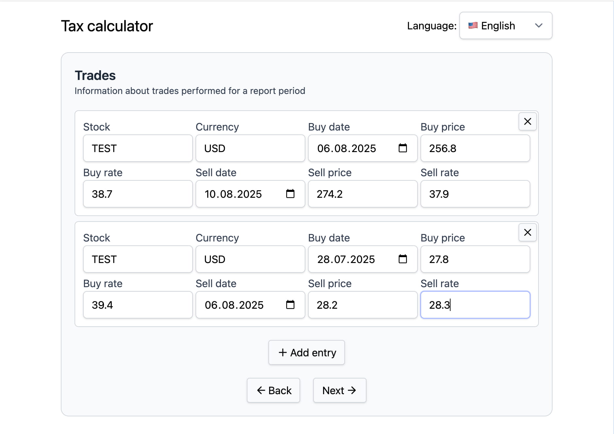
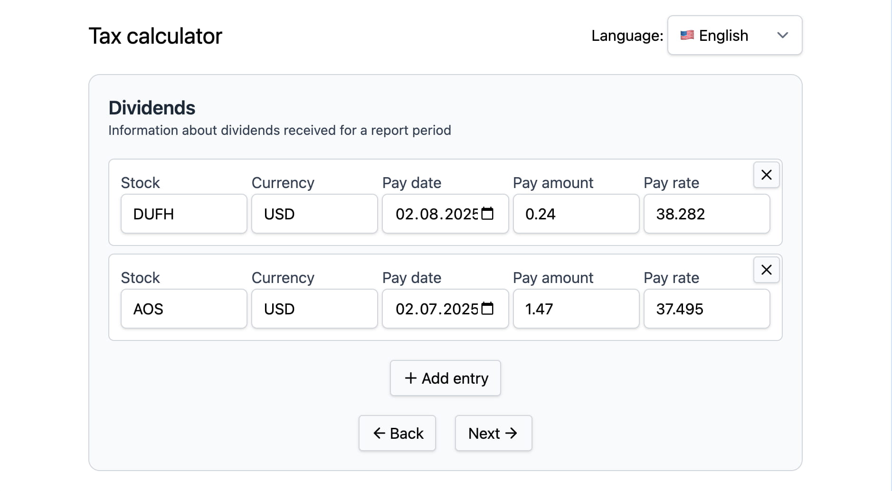

In my day-to-day work, forms, and especially wizard forms are one of the hardest
frontend challenges. And I'm not satisfied with my current approach to building
them.

So I decided to kill two birds with one stone: research more modern & robust
way of building wizard forms and build something useful for my wife. Well, now
when I think of it, I'm actually killing three birds: I'm also writing
an article about it 😜

## Current approach

Let's take a step back, and look at how current approach fails to scale.

First of all, it is based on React [context](https://react.dev/learn/passing-data-deeply-with-context).
And there's nothing really bad about it, it's just sometimes (especially when
the shared state grows) it becomes really hard to keep it performant.

Secondly, form validation is based on [useImperativeHandle](https://react.dev/reference/react/useImperativeHandle)
(I know, ugly 🥲), where basically child components are validating a pieces of
the whole form, and it's called from the parent component to validate the whole
step before proceeding. In my opinion, this is the messiest part of the setup,
and what drove me to research alternatives.

## Task ahead

I'm a big fan of POC (proof-of-concept), but, unfortunately, I can't disclose
the project that I'm working on. So I had to think about something fairly complicated
that would cover all of the needs for my work, be something interesting, and useful.
It's a tricky balance to handle! But thankfully, my wife showed me how messy her
taxes calculations in Excel are, so I decided to build small utility wizard that
will collect all information about trades and dividends and calculate everything
that is needed automatically.

This wizard will consist of four screens:

1. Setup step - On this step we’ll setup a couple of variables that will be used
   throughout the form.
2. Trades step - This form is essentially an array of entries, which can be dynamically
   added/removed.
3. Dividends step - Same as previous step, this one again is dynamic list of entries.
4. Results step - This is where everything is calculated.

Let's define fields for all of the steps first.

On the setup step:

- name of the report
- leftover from the previous year (amount of money lost when selling stocks)
- target currency (currency in which all results will be displayed)
- income tax (the percentage for the income, for example 18% in Ukraine)
- army tax (5% in Ukraine)

On the trades step, each entry:

- stock name
- stock currency
- date bought
- buying price
- exchange rate for buying date
- date sold
- selling price
- exchange rate for selling date

On the dividends step, each entry:

- stock name
- stock currency
- date paid
- amount paid
- exchange rate for the paid date

Of course, I should say that this form is not financial advice in any way, I'm building
it for personal use only, and sharing it to only show interesting technical decisions.

## Approach

The approach that I've chosen is as follows:

- Global state that will store the whole wizard state
- Centralized validation of each step with schemas
- [react-hook-form](https://react-hook-form.com/) for actual form inputs

By storing our state in the global store we'll be able to easily share the data
between steps, and there'll be a central place if we'll need to do something cross-steps.
By centralizing validations with schemas we'll no longer have validations spread
out in every component, and get rid of imperative handles.

### Schema validation

In the past I had pretty limited experience with [zod](https://zod.dev/), but I
didn't realise how powerful this library is! In essence, it's a library to validate
data with _schemas_, but applications of it are limitless.

Let's define our schemas with zod:

```typescript
import * as z from "zod";

export const DEFAULT_TARGET_CURRENCY = "UAH";
export const DEFAULT_ARMY_TAX = 5;
export const DEFAULT_INCOME_TAX = 18;

const num = (val: unknown) => {
  if (val === "" || val === undefined) return undefined;
  const num = Number(val);
  return isNaN(num) ? undefined : num;
};

export const SetupSchema = z.object({
  name: z.string().nonempty(),
  targetCurrency: z
    .string()
    .transform((val) => (val === "" ? undefined : val))
    .default(DEFAULT_TARGET_CURRENCY),
  leftover: z.preprocess(num, z.number().min(0).optional()).default(0),
  armyTax: z
    .preprocess(num, z.number().min(0).max(100).optional())
    .default(DEFAULT_ARMY_TAX),
  incomeTax: z
    .preprocess(num, z.number().min(0).max(100).optional())
    .default(DEFAULT_INCOME_TAX),
});

export type SetupSchemaType = z.infer<typeof SetupSchema>;

export const TradeSchema = z
  .object({
    stockName: z.string().trim().nonempty(),
    stockCurrency: z.string().trim().nonempty(),
    buyDate: z.iso.date(),
    buyPrice: z.number(),
    buyExchangeRate: z.number(),
    sellDate: z.iso.date(),
    sellPrice: z.number(),
    sellExchangeRate: z.number(),
  })
  .refine((data) => new Date(data.buyDate) < new Date(data.sellDate), {
    message: "Buy date must be before sell date",
    path: ["buyDate"],
  });

export type TradeSchemaType = z.infer<typeof TradeSchema>;

export const TradesSchema = z.object({
  trades: z.array(TradeSchema),
});

export type TradesSchemaType = z.infer<typeof TradesSchema>;

export const DividendSchema = z.object({
  stockName: z.string().trim().nonempty(),
  stockCurrency: z.string().trim().nonempty(),
  payDate: z.iso.date(),
  payAmount: z.number(),
  payExchangeRate: z.number(),
});

export type DividendSchemaType = z.infer<typeof DividendSchema>;

export const DividendsSchema = z.object({
  dividends: z.array(DividendSchema),
});

export type DividendsSchemaType = z.infer<typeof DividendsSchema>;
```

This schema neatly describes every step form, which fields are required, what
types they have and with [refine](https://zod.dev/api#refinements) schemas also
allow for cross-field validations.

### Global store

In the past, I also worked with several global state libraries, for example,
[redux](https://redux.js.org/). Honestly, [zustand](https://github.com/pmndrs/zustand)
that I picked for this task is pretty similar to redux, here's a [comparison](https://zustand.docs.pmnd.rs/getting-started/comparison).
The main difference is that zustand does not require to setup a provider, which
simplifies setup, so that's why I've picked it.

Let's implement a global state for the wizard:

```typescript
import { create } from "zustand";
import {
  DEFAULT_ARMY_TAX,
  DEFAULT_INCOME_TAX,
  DEFAULT_TARGET_CURRENCY,
  type DividendsSchemaType,
  type SetupSchemaType,
  type TradesSchemaType,
} from "./schema";

type TaxWizardState = {
  currentStep: number;
  setup: SetupSchemaType;
  trades: TradesSchemaType["trades"];
  dividends: DividendsSchemaType["dividends"];
};

type TaxWizardActions = {
  back: () => void;
  goTo: (step: 0 | 1 | 2) => void;
  completeSetup: (newSetup: SetupSchemaType) => void;
  completeTrades: (newTrades: TradesSchemaType["trades"]) => void;
  completeDividends: (newDividends: DividendsSchemaType["dividends"]) => void;
  reset: () => void;
};

export const useTaxWizardStore = create<TaxWizardState & TaxWizardActions>()(
  (set, _get, store) => ({
    currentStep: 0,

    setup: {
      name: "",
      targetCurrency: DEFAULT_TARGET_CURRENCY,
      leftover: 0,
      armyTax: DEFAULT_ARMY_TAX,
      incomeTax: DEFAULT_INCOME_TAX,
    },
    trades: [],
    dividends: [],

    back: () =>
      set(({ currentStep, ...other }) => ({
        ...other,
        currentStep: Math.max(currentStep - 1, 0),
      })),
    goTo: (step) =>
      set(({ currentStep, ...other }) => ({
        ...other,
        currentStep: step,
      })),
    completeSetup: (newSetup) =>
      set(({ currentStep, ...other }) => ({
        ...other,
        setup: newSetup,
        currentStep: currentStep + 1,
      })),
    completeTrades: (newTrades) =>
      set(({ currentStep, ...other }) => ({
        ...other,
        trades: newTrades,
        currentStep: currentStep + 1,
      })),
    completeDividends: (newDividends) =>
      set(({ currentStep, ...other }) => ({
        ...other,
        dividends: newDividends,
        currentStep: currentStep + 1,
      })),
    reset: () => set(store.getInitialState()),
  }),
);
```

In this store, I've defined a simple state for the current step, defaults for
every step, and some utility functions, that will be called on every step submissions.

### react-hook-form

Lastly, it's time to tie it all together with [react-hook-form](https://react-hook-form.com/),
a library that I didn't have experience at all, because on my work, all of the
inputs are custom, and state for them is managed manually. To be honest, it was
a little bit harder and at the same time simpler to setup.

While `react-hook-form` was new to me, I quickly saw the benefit: no more manually
wiring up `useState` for each field.

Let me show you a couple of parts of the forms:

```tsx
export function SetupForm() {
  const { t } = useTranslation();

  const setup = useTaxWizardStore((state) => state.setup);
  const completeSetup = useTaxWizardStore((state) => state.completeSetup);

  const {
    register,
    handleSubmit,
    formState: { errors, isSubmitting },
  } = useForm({
    resolver: zodResolver(SetupSchema),
    defaultValues: setup,
  });

  const onSubmit = (data: SetupSchemaType) => {
    completeSetup(data);
  };

  return (
    <form
      className="mx-auto grid max-w-[600px] grid-cols-1 gap-5"
      onSubmit={handleSubmit(onSubmit)}
    >
      <div className="grid grid-cols-2 gap-2">
        <Input
          id="setup-name"
          label={t("setup.name")}
          error={errors.name?.message}
          type="text"
          required
          autoComplete="name"
          placeholder="Enter the report name"
          {...register("name")}
        />
        {/* other inputs ... */}
      </div>
      <Button
        type="submit"
        className="justify-evenly justify-self-end"
        disabled={isSubmitting}
      >
        {t("continue")} <ArrowRight className="size-4.5" />
      </Button>
    </form>
  );
}
```

Everything related to the form is basically managed in the `useForm` hook. This,
honestly, threw me up at first, I was wondering where the state is, and how it's
submitting the data. But now I think it's much simpler than defining everything
manually.

The second example is with dynamic array of entries:

```tsx
export function TradesForm() {
  const back = useTaxWizardStore((state) => state.back);
  const trades = useTaxWizardStore((state) => state.trades);
  const completeTrades = useTaxWizardStore((state) => state.completeTrades);

  const {
    register,
    control,
    handleSubmit,
    formState: { errors, isSubmitting },
  } = useForm({
    resolver: zodResolver(TradesSchema),
    defaultValues: { trades },
  });

  const { fields, append, remove } = useFieldArray({
    control,
    name: "trades",
  });

  const onSubmit = (data: TradesSchemaType) => {
    completeTrades(data.trades);
  };

  return (
    <form className="grid grid-cols-1 gap-5" onSubmit={handleSubmit(onSubmit)}>
      <ul className="space-y-2">
        {fields.map((item, index) => (
          <li
            key={item.id}
            className="grid grid-cols-2 md:grid-cols-4 lg:grid-cols-8 gap-1 relative p-3 bg-white border border-gray-300 rounded-md"
          >
            <Input
              id={`trades.${index}.stockName`}
              label="Stock"
              type="text"
              error={errors.trades?.[index]?.stockName?.message}
              required
              placeholder="Stock name"
              {...register(`trades.${index}.stockName`)}
            />

            {/* other form fields ... */}

            <Button
              type="button"
              icon
              onClick={() => remove(index)}
              className="absolute top-0.5 right-0.5"
              title={`Remove entry ${index}`}
            >
              <X className="size-4.5" />
            </Button>
          </li>
        )}
      </ul>

      <Button
        type="button"
        className="justify-self-center"
        onClick={() =>
          append({
            stockName: "",
            stockCurrency: "",
            buyDate: "",
            buyPrice: 0,
            buyExchangeRate: 0,
            sellDate: "",
            sellPrice: 0,
            sellExchangeRate: 0,
          })
        }
      >
        <Plus className="size-4.5" /> Add entry
      </Button>
      {/* Another buttons, such as submit*/}
    </form>
  );
}
```

I really enjoyed working with field arrays, to be honest. It required so much
code and covering of edge cases to get multiple rows of inputs to work, and in
this library - it's just built-in! That is so awesome!

## Results

Here's a couple of screenshots of resulting utility

Setup step:


Trades step:


Dividends step:


Of course, I haven't included the full code examples, but they are available in
this repository: [tax-calc](https://github.com/chornonoh-vova/tax-calc). Beware,
it's not "production-ready" in any sense, but I think it demonstrates an overall
idea on how to better structure such complicated forms. It requires a little bit
of polish to be released, in my opinion.

## Conclusions

In the end, this little project proved that a schema-first approach with zod, a
lightweight global store like zustand, and react-hook-form can make wizard forms
much cleaner and less painful to build. It started as a quick experiment for my
wife’s taxes, but now I have a solid structure I can reuse at work (and maybe even
improve with persistence, translations, and CSV imports down the line).
