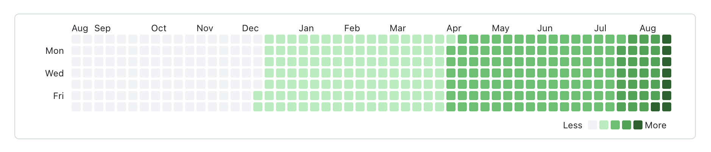
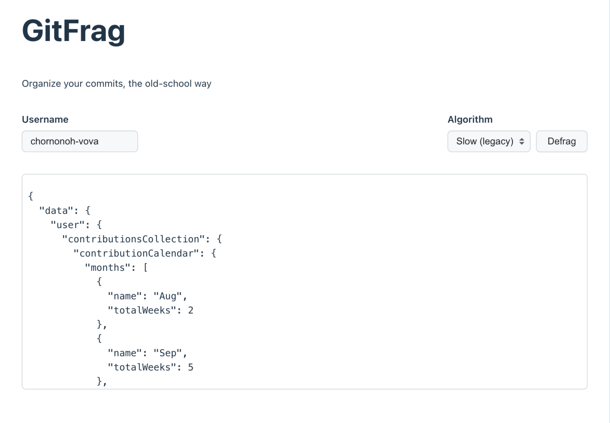
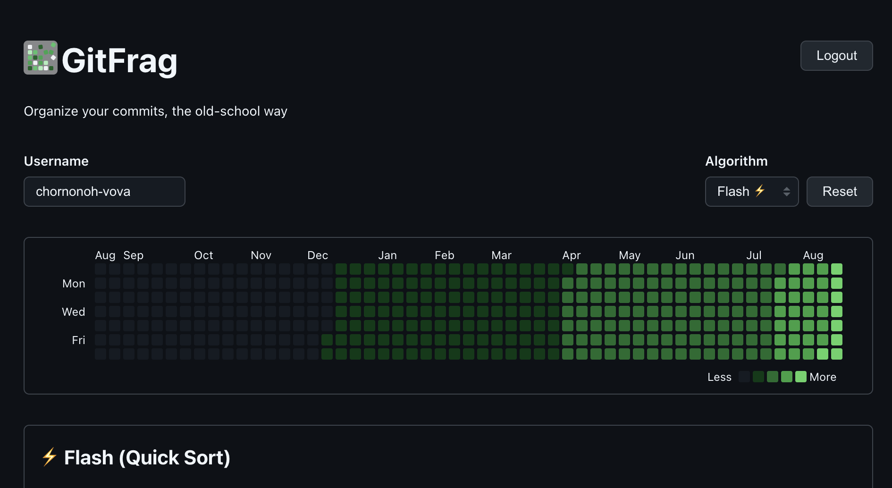

This week, I decided to participate in the [GitHub hackathon](https://github.blog/open-source/for-the-love-of-code-2025/)
and build something fun (as always), but this time it will involve working with
the GitHub API.

The idea is to build a utility to perform defragmentation (just like old-style
disk defragmentation) on your profile contributions. This should look super fun
visually, especially a progress animation. And, additionally, I’m thinking of
implementing a couple of different sorting algorithms, so it’ll be even more fun
observing how they compare to each other.

Just look at how messy my contributions look out of the box!


It would be much better if they were neatly organized 🧐



That's exactly what I'll be building!

## Day 1: Setup & Data

To kick it off, let’s set up the project, do some initial scaffolding, and
retrieve the data from the GraphQL API.

I’ve decided to go with my old trusty Vite once more:

```bash
npm create vite@latest
```

We’ll also need to install a few additional dependencies:

```bash
npm install @tanstack/react-query dedent zod
```

For the UI elements, I’m trying to follow GitHub’s UI itself. When I was creating
these input & UI elements, I was basically looking at UI and re-creating it.
Turns out, there’s a whole slew of components available, and a design system:
[Primer](https://primer.style) 🤦. I wish I knew about it when I started, but oh
well, making things from scratch is fun too 😉

To request the GraphQL API, I’ve created a
[Personal Access Token](https://docs.github.com/en/authentication/keeping-your-account-and-data-secure/managing-your-personal-access-tokens),
because, when requesting without it, I was rate-limited 😢

Here's how I setup the API request to get contributions:

```ts
import { queryOptions, useQuery } from "@tanstack/react-query";
import dedent from "dedent";
import { z } from "zod";

const API_URL = "https://api.github.com/graphql";

const ContributionsSchema = z.object({
  data: z.object({
    user: z
      .object({
        contributionsCollection: z.object({
          contributionCalendar: z.object({
            months: z.array(
              z.object({
                name: z.string(),
                totalWeeks: z.number(),
              }),
            ),
            weeks: z.array(
              z.object({
                contributionDays: z.array(
                  z.object({
                    color: z.string(),
                    contributionCount: z.number(),
                  }),
                ),
              }),
            ),
          }),
        }),
      })
      .nullable(),
  }),
  errors: z
    .array(
      z.object({
        type: z.string(),
        message: z.string(),
      }),
    )
    .optional(),
});

export type Contributions = z.infer<typeof ContributionsSchema>;

export function useContributions(username: string) {
  return useQuery(contributionsOptions(username));
}

function contributionsOptions(username: string) {
  return queryOptions({
    queryKey: ["contributions", username],
    queryFn: () => fetchContributions(username),
  });
}

export async function fetchContributions(
  username: string,
): Promise<Contributions> {
  const query = dedent`{
      user(login: "${username}") {
        contributionsCollection {
          contributionCalendar {
            months {
              name
              totalWeeks
            }
            weeks {
              contributionDays {
                color
                contributionCount
              }
            }
          }
        }
      }
    }`;

  const response = await fetch(API_URL, {
    method: "POST",
    headers: {
      Authorization: `Bearer ${import.meta.env.VITE_GITHUB_PAT}`,
    },
    body: JSON.stringify({ query }),
  });

  if (!response.ok) {
    const details = await response.json();
    throw new Error(
      `Error fetching contributions ${response.status} ${response.statusText}`,
      { cause: details?.message },
    );
  }

  const raw = await response.json();

  return ContributionsSchema.parse(raw);
}
```

This Zod schema is wild, to be honest 😅

Now, after connecting everything, here’s the result for day 1:



## Day 2: Contributions Graph

Today’s goal was simple on paper: render a GitHub-like contribution graph.
But as always, simple things hide unexpected complexity 😅

I decided to go with plain old `<div>`s and `<span>`s and finally found a
perfect use case for [CSS Subgrid](https://developer.mozilla.org/en-US/docs/Web/CSS/CSS_grid_layout/Subgrid).
It’s supported by most modern browsers now, and honestly, it made the layout
so much cleaner!

Here's a component that is rendering the graph:

```tsx
export function ContributionsGraph({
  months,
  weeks,
  contributionDays,
}: {
  months: ContributionCalendarMonth[];
  weeks: number;
  contributionDays: ContributionCalendarDay[];
}) {
  return (
    <div
      className="contributions-graph-wrapper"
      style={{
        gridTemplateColumns: `30px repeat(${weeks}, 12px)`,
      }}
    >
      <div className="contributions-months">
        {months.map(({ name, totalWeeks }, index) => (
          <span
            key={index}
            style={{
              gridColumn: `span ${totalWeeks}`,
            }}
          >
            {name}
          </span>
        ))}
      </div>
      <div className="contributions-days-of-week">
        <span style={{ gridRow: 2 }}>Mon</span>
        <span style={{ gridRow: 4 }}>Wed</span>
        <span style={{ gridRow: 6 }}>Fri</span>
      </div>
      <div className="contributions-grid">
        {contributionDays.map(({ color, contributionCount, date }, index) => (
          <span
            key={date}
            className="contribution"
            style={{
              backgroundColor: color,
              gridArea: `${(index % 7) + 1} / ${Math.floor(index / 7) + 1}`,
            }}
            title={`${contributionCount} contributions on ${date}`}
          ></span>
        ))}
      </div>
    </div>
  );
}
```

And styles, that enable this pretty layout:

```css
.contributions-graph-wrapper {
  border-radius: 6px;
  border: 1px solid #d1d9e0;
  padding: 12px 8px;
  overflow: scroll;
  max-height: 300px;
  display: grid;
  gap: 3px;
  grid-template-rows: repeat(8, 12px);
}

.contributions-months {
  font-size: 12px;
  line-height: 12px;
  font-weight: 400;
  display: grid;
  grid-template-columns: subgrid;
  grid-column: 2 / -1;
}

.contributions-days-of-week {
  font-size: 12px;
  line-height: 12px;
  font-weight: 400;
  display: grid;
  grid-template-rows: subgrid;
  grid-row: 2 / -1;
}

.contributions-grid {
  display: grid;
  grid-template-columns: subgrid;
  grid-template-rows: subgrid;
  grid-row: 2 / -1;
  grid-column: 2 / -1;
}

.contribution {
  border-radius: 2px;
}
```

Without further ado, here's a result:


Since I had a little time left, I also implemented the first and easiest
defragmentation method: the trusty ol’ bubble sort

```ts
type CompareFn<T> = (a: T, b: T) => number;

export function bubbleSort<T>(arr: T[], compareFn: CompareFn<T>): T[] {
  const res = structuredClone(arr);
  const n = res.length;
  let swapped = false;

  for (let i = 0; i < n - 1; ++i) {
    swapped = false;

    for (let j = 0; j < n - i - 1; ++j) {
      if (compareFn(res[j], res[j + 1]) > 0) {
        [res[j], res[j + 1]] = [res[j + 1], res[j]];
        swapped = true;
      }
    }

    if (!swapped) {
      break;
    }
  }
  return res;
}
```

On top of that, I added a reset button to bring contributions back to their
original, unsorted state. With one of the sorting methods implemented, it starts
to look a lot more like our goal:


## Day 3: Algorithms, Explainers & Animation

A lot of progress on this day!

I've implemented multiple sorting algorithms, added algorithm explainers, and
added an animation playback (without controls for the moment).

Let's go through algorithms, the first one is merge sort:

```ts
export function mergeSort<T>(
  arr: T[],
  compareFn: CompareFn<T>,
  recordingFn: RecordingFn<T>,
): T[] {
  const res = structuredClone(arr);

  const aux = new Array(res.length);

  function merge(l: number, m: number, r: number) {
    let x = 0;
    for (let i = l; i < r; ++i) {
      aux[x] = res[i];
      x += 1;
    }

    let i = 0,
      j = m;
    let k = l,
      n = m - l;

    while (i < n || j < r) {
      if (j === r || (i < n && compareFn(aux[i], res[j]) <= 0)) {
        recordingFn(k, aux[i]);
        res[k] = aux[i];
        i += 1;
      } else {
        recordingFn(k, res[j]);
        res[k] = res[j];
        j += 1;
      }
      k += 1;
    }
  }

  for (let len = 1; len < res.length; len *= 2) {
    for (let lo = 0; lo < res.length - len; lo += 2 * len) {
      const mid = lo + len;
      const hi = Math.min(mid + len, res.length);
      merge(lo, mid, hi);
    }
  }

  return res;
}
```

You can notice two callbacks now in the function parameters: the first one is for
elements comparisons, and the other one is for steps recording. This second callback
allows for remembering of the steps performed by algorithm, and playing it back
to the users.

Here's an implementation of quick sort:

```ts
export function quickSort<T>(
  arr: T[],
  compareFn: CompareFn<T>,
  recordingFn: RecordingFn<T>,
): T[] {
  const res = structuredClone(arr);

  function partition(l: number, r: number): number {
    let p = l + Math.floor(Math.random() * (r - l + 1));
    [res[l], res[p]] = [res[p], res[l]];
    let t = res[l],
      i = l,
      j = r + 1;
    while (true) {
      i += 1;
      while (i <= r && compareFn(res[i], t) < 0) {
        i += 1;
      }
      j -= 1;
      while (compareFn(res[j], t) > 0) {
        j -= 1;
      }
      if (i > j) {
        break;
      }
      recordingFn(i, res[j]);
      recordingFn(j, res[i]);
      [res[i], res[j]] = [res[j], res[i]];
    }
    recordingFn(l, res[j]);
    recordingFn(j, res[l]);
    [res[l], res[j]] = [res[j], res[l]];
    return j;
  }

  function qsort(l: number, r: number) {
    while (l < r) {
      const p = partition(l, r);
      if (p - l < r - p) {
        qsort(l, p - 1);
        l = p + 1;
      } else {
        qsort(p + 1, r);
        r = p - 1;
      }
    }
  }

  qsort(0, res.length - 1);

  return res;
}
```

And, finally, the fastest one, counting sort:

```ts
type GetterFn<T> = (element: T) => number;

export function countingSort<T>(
  arr: T[],
  getterFn: GetterFn<T>,
  recordingFn: RecordingFn<T>,
): T[] {
  const res = structuredClone(arr);

  const map = new Map<number, T[]>();
  for (const item of res) {
    const key = getterFn(item);
    if (map.has(key)) {
      map.get(key)!.push(item);
    } else {
      map.set(key, [item]);
    }
  }

  const maximum = res.reduce((max, curr) => Math.max(max, getterFn(curr)), 0);
  let i = 0;

  for (let key = 0; key <= maximum; ++key) {
    if (!map.has(key)) {
      continue;
    }

    for (const item of map.get(key)!) {
      recordingFn(i, item);
      res[i] = item;
      i++;
    }
  }

  return res;
}
```

This one is special, because instead of comparison callback, it just takes a
getter callback, which allows this algorithm to group elements by key and then
reconstruct a resulting array.

I've written a more detailed explainers for every algorithm, that includes a time
complexity, and even fun facts. Link to the app will be at the end 😉

## Day 4: Play/Pause & GitHub OAuth integration

My little challenge is almost done, and it's shaping up really nicely!

Today I tackled one of the hardest parts:

- GitHub OAuth integration
- Deployment
- Play & pause functionality

Here's how it looks when you logged in, and paused animation in the middle:


OAuth integration consists of 5 endpoints that I've designed:

### 1. Small login & logout endpoints

Login endpoint is one of the smallest, and the only job of it is to redirect to
the GitHub, so user can log in there:

```ts
export default function handler(_req: VercelRequest, res: VercelResponse) {
  res.redirect(
    `https://github.com/login/oauth/authorize?client_id=${process.env.GITHUB_CLIENT_ID}&scope=read:user`,
  );
}
```

Bonus point is that application's client id is not exposed to the frontend this way.

Logout endpoint is very simple as well - it only unsets the cookie.

```ts
export default async function handler(
  _req: VercelRequest,
  res: VercelResponse,
) {
  res.setHeader("Set-Cookie", [
    "gh_token=; Path=/; HttpOnly; Secure; SameSite=Strict; Max-Age=0",
  ]);

  res.status(200).json({ success: true });
}
```

### 2. Callback endpoint

When user authorizes through GitHub, they'll be redirected to this endpoint, where
we need to exchange short-lived `code` for an access token. I've opted out to
storing access token in HTTP-only cookie, to prevent XSS attacks.

```ts
type AccessTokenResponse = {
  access_token: string;
};

type ErrorResponse = {
  error: string;
  error_description: string;
};

export default async function handler(req: VercelRequest, res: VercelResponse) {
  const code = req.query.code;

  if (!code || typeof code !== "string") {
    return res.status(403).json({ error: "Missing code" });
  }

  const response = await fetch("https://github.com/login/oauth/access_token", {
    method: "POST",
    headers: {
      Accept: "application/json",
      "Content-Type": "application/json",
    },
    body: JSON.stringify({
      client_id: process.env.GITHUB_CLIENT_ID,
      client_secret: process.env.GITHUB_CLIENT_SECRET,
      code,
    }),
  });

  const data = (await response.json()) as AccessTokenResponse & ErrorResponse;

  if (data.error) {
    return res.status(400).json({ error: data.error_description });
  }

  res.setHeader("Set-Cookie", [
    `gh_token=${data.access_token}; Path=/; HttpOnly; Secure; SameSite=Strict`,
  ]);

  res.redirect("/");
}
```

### 3. User & Contributions endpoints

These endpoints consume an access token, and make requests to GitHub API on behalf
of the user.

User endpoint:

```ts
export default async function handler(req: VercelRequest, res: VercelResponse) {
  const token = req.cookies.gh_token;

  if (!token) {
    return res.status(200).json({ authenticated: false });
  }

  const query = dedent`
    {
      viewer {
        login
      }
    }`;

  const response = await fetch("https://api.github.com/graphql", {
    method: "POST",
    headers: {
      Authorization: `Bearer ${token}`,
      "Content-Type": "application/json",
    },
    body: JSON.stringify({ query }),
  });

  if (!response.ok) {
    return res.status(200).json({ authenticated: false });
  }

  const data = (await response.json()) as any;

  if (data.errors) {
    return res.status(200).json({ authenticated: false });
  }

  res.status(200).json({
    authenticated: true,
    username: data.data.viewer.login,
  });
}
```

Contributions endpoint:

```ts
export default async function handler(req: VercelRequest, res: VercelResponse) {
  const token = req.cookies.gh_token;

  if (!token) {
    return res.status(401).json({ error: "Not authenticated" });
  }

  const username = req.query.username;

  if (!username || typeof username !== "string") {
    return res.status(400).json({ error: "Missing 'username' query param" });
  }

  const query = dedent`
    {
      user(login: "${username}") {
        contributionsCollection {
          contributionCalendar {
            months {
              name
              totalWeeks
            }
            weeks {
              contributionDays {
                color
                contributionCount
                date
              }
            }
          }
        }
      }
    }`;

  const response = await fetch("https://api.github.com/graphql", {
    method: "POST",
    headers: {
      Authorization: `Bearer ${token}`,
      "Content-Type": "application/json",
    },
    body: JSON.stringify({ query }),
  });

  const data = await response.json();

  res.status(200).json(data);
}
```

## Day 5: Dark theme, Logo & Polish

I took a last day very easy, did a little bit of refactoring, added a dark theme
(of course, I'm a developer, after all 🧑‍💻). And I designed a nice little icon,
so at this point, an application is complete, and you can open it up as well:
[GitFrag](https://gitfrag.vercel.app/)



Go ahead, try it out! Your portfolio deserves a defragmentation as well!

## Conclusion

This was fun little challenge. Even though I have only like 1 hour each day, I
was able to plan out this little experiment, and complete it even before the deadline
that I set for myself. One more challenge for me was to post about my journey
every day in my social network accounts. Thank you for following me and going
through this adventure with me!
