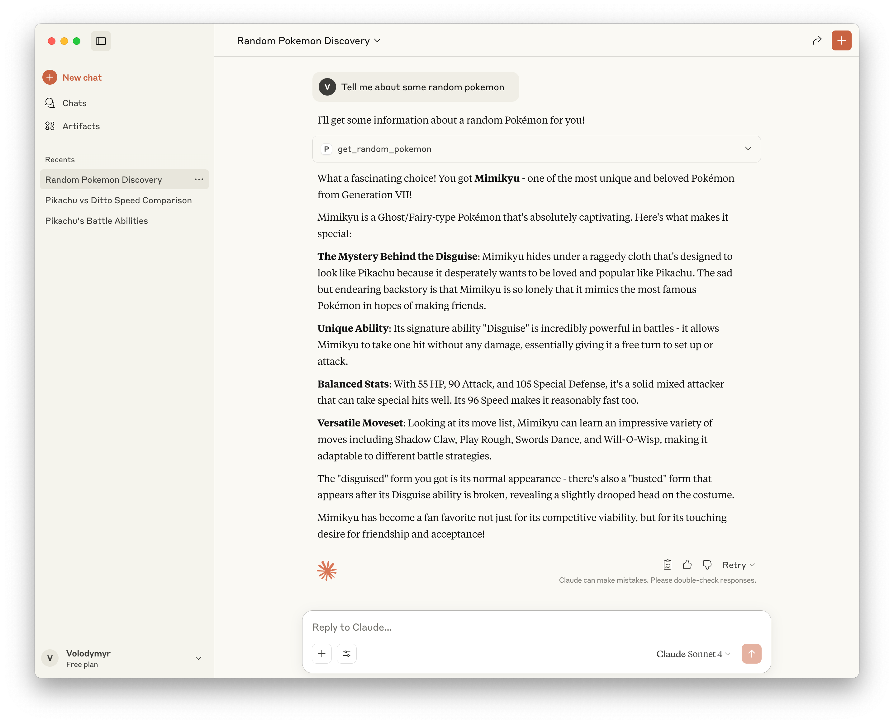
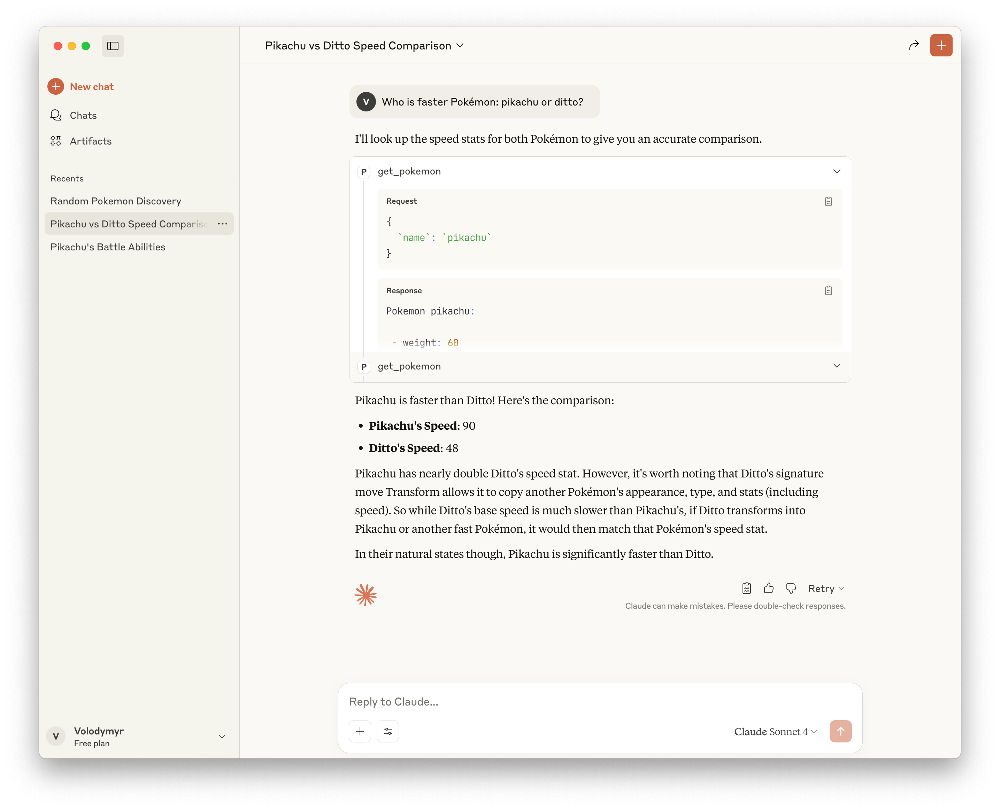
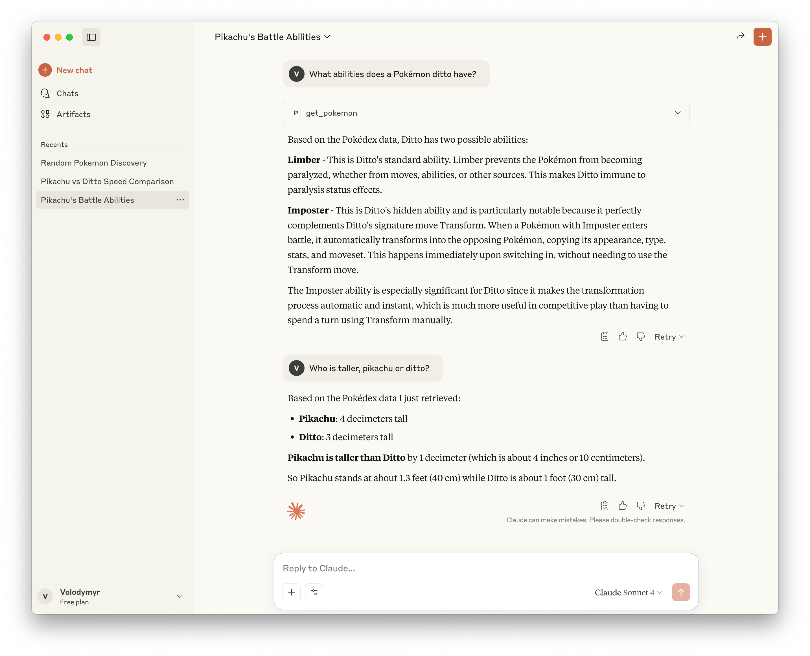

The AI landscape is evolving rapidly. Undeniably, it's a remarkable piece of technology,
and every product, seems like it, wants to have some AI-powered part. And my project
at work is no exception, so I decided to take on an initiative and try to build something
that can benefit a product.

## Enter MCP

One of the biggest advancements recently is MCP. What is MCP you ask? This abbreviation
stands for **Model Context Protocol**. From the technical side, it's just a standardized
JSON schema. But from non-technical side it's an important milestone in the development
of AI as a whole - now every AI provider (such as OpenAI, Anthropic or Alphabet)
wouldn't need to reinvent the wheel. Customers, such as you and me, also benefit
from it: we receive a standard way for our tools to communicate. Just imagine all
of the cool possibilities that can be achieved here!

So on the previous weekend I built a small proof-of-concept MCP server for our
project. Even though it was tiny, from my point of view, it shed a little
bit of light on what can be potentially done in the future. Unfortunately, I cannot
share the details of this MCP server that I built at my work, but what I can do for
a blog - is to build another one!

## Pokémon API

There's this nice public API called [PokeAPI](https://pokeapi.co/), that contains
an enormous amount of Pokémon data, accessible via free & open-source RESTful API.
Let's build an MCP server so our AI could answer some questions about Pokémon!

## Setup

I built an MCP server with Node.js and TypeScript, but it can also be built with
Python, Java, Kotlin or C#. For more information take a look at this [quickstart](https://modelcontextprotocol.io/quickstart/server).

As far as dependencies go, we'll only need two:

- [@modelcontextprotocol/sdk](https://www.npmjs.com/package/@modelcontextprotocol/sdk):
  SDK for building MCP servers with TypeScript
- [zod](https://www.npmjs.com/package/zod): for schema validation

Here's the basic setup for the server:

```ts
import { McpServer } from "@modelcontextprotocol/sdk/server/mcp.js";
import { StdioServerTransport } from "@modelcontextprotocol/sdk/server/stdio.js";

import { pokemonTool, pokemonCallback } from "./tools/pokemon.js";
import {
  randomPokemonTool,
  randomPokemonCallback,
} from "./tools/random-pokemon.js";

const server = new McpServer({
  name: "pokemon",
  version: "1.0.0",
  capabilities: {
    resources: {},
    tools: {},
  },
});

server.registerTool(pokemonTool.name, pokemonTool, pokemonCallback);
server.registerTool(
  randomPokemonTool.name,
  randomPokemonTool,
  randomPokemonCallback,
);

try {
  const transport = new StdioServerTransport();
  await server.connect(transport);
  console.error("Pokémon MCP Server running on stdio");
} catch (error) {
  console.error("Fatal error:", error);
  process.exit(1);
}
```

Here, I'm setting up a basic MCP server (using stdio transport), and registering
all of the tools.

The stdio transport is key here. It allows MCP clients like Claude Desktop to
communicate with our server through standard input/output streams. This modular
approach with separate tool files makes the codebase easier to maintain and extend.

For this little fun project, I've created 2 tools:

- `get_pokemon`, that returns an information about some Pokémon
- `get_random_pokemon`, that gets a list of all Pokémon, and randomly selects and
  returns information about one of them

## API Client

Let's look at how API client is setup. It is utilizing native Node.js fetch, and
a function to call Pokémon API is pretty simple:

```ts
const BASE_URL = "https://pokeapi.co/api/v2/";
const USER_AGENT = "pokemon-mcp/1.0.0";

export async function pokeAPIRequest<T>(
  endpoint: string,
  params?: Record<string, string>,
): Promise<T | null> {
  const searchParams = new URLSearchParams(params);
  const requestUrl = new URL(`${endpoint}?${searchParams}`, BASE_URL);

  console.error("PokeAPI request url:", requestUrl.toString());

  const headers = {
    Accept: "application/json",
    "Content-Type": "application/json",
    "User-Agent": USER_AGENT,
  };

  try {
    const response = await fetch(requestUrl, {
      method: "GET",
      headers,
    });

    if (!response.ok) {
      throw new Error(`HTTP error: ${response.status} ${response.statusText}`);
    }

    return (await response.json()) as T;
  } catch (error) {
    console.error("Error making PokeAPI request:", error);
    return null;
  }
}
```

## Data processing

Here's a utility module that requests information about a Pokémon by name, and
returns formatted representation:

```ts
import { z } from "zod";
import { pokeAPIRequest } from "./client.js";

const PokemonSchema = z.object({
  id: z.number(),
  name: z.string(),
  height: z.number(),
  weight: z.number(),
  abilities: z.array(
    z.object({
      ability: z.object({
        name: z.string(),
      }),
      is_hidden: z.boolean(),
    }),
  ),
  moves: z.array(
    z.object({
      move: z.object({
        name: z.string(),
      }),
    }),
  ),
  stats: z.array(
    z.object({
      base_stat: z.number(),
      effort: z.number(),
      stat: z.object({
        name: z.string(),
      }),
    }),
  ),
});

type Pokemon = z.infer<typeof PokemonSchema>;

function formatAbility(name: string, hidden: boolean) {
  return name + (hidden ? " (hidden)" : "");
}

function formatStat(name: string, stat: number) {
  return `${name} (${stat})`;
}

export function formatPokemon(pokemon: Pokemon) {
  return [
    `Pokemon ${pokemon.name}:\n`,
    ` - weight: ${pokemon.weight}`,
    ` - height: ${pokemon.height}`,
    ` - abilities: ${pokemon.abilities
      .map((a) => formatAbility(a.ability.name, a.is_hidden))
      .join(", ")}`,
    ` - moves: ${pokemon.moves.map((m) => m.move.name).join(", ")}`,
    ` - stats: ${pokemon.stats
      .map((s) => formatStat(s.stat.name, s.base_stat))
      .join(", ")}`,
  ].join("\n");
}

export async function getPokemon(name: string): Promise<string | null> {
  const pokemonData = await pokeAPIRequest(`pokemon/${name}`);

  if (!pokemonData) {
    return null;
  }

  const parsedPokemon = PokemonSchema.parse(pokemonData);

  return formatPokemon(parsedPokemon);
}
```

There I've used `zod` to parse and verify schema that I've getting from the API.
Also, this schema is not full, I've just specified fields that I'm actually using
when formatting information.

Here's a utility module that gets list of all Pokémon:

```ts
import { z } from "zod";
import { pokeAPIRequest } from "./client.js";

const PokemonListSchema = z.object({
  results: z.array(
    z.object({
      name: z.string(),
    }),
  ),
});

export async function getPokemonList(): Promise<string[] | null> {
  const pokemonsData = await pokeAPIRequest("pokemon", {
    limit: "100000",
    offset: "0",
  });

  if (!pokemonsData) {
    return null;
  }

  const pokemonList = PokemonListSchema.parse(pokemonsData);

  return pokemonList.results.map((p) => p.name);
}
```

Again, I'm calling and API, parsing with `zod`, and mapping over the results to
return only the names of all Pokémon. I've cheated a little bit here: I've used
an enormous limit in the request, just to make sure that I get all the Pokémon
on one request. On production, though, it's better to implement a proper pagination
or caching.

## Tools

Let's take a look at how actual tools are implemented.

Here's an implementation of the `get_pokemon` tool:

```ts
import type { ToolCallback } from "@modelcontextprotocol/sdk/server/mcp.js";
import { z } from "zod";
import { getPokemon } from "../api/pokemon.js";

const PokemonName = z.string().nonempty();

export const pokemonTool = {
  name: "get_pokemon",
  title: "Pokemon information tool",
  description: "Get information about a pokemon",
  inputSchema: { name: PokemonName },
};

export const pokemonCallback: ToolCallback<{
  name: typeof PokemonName;
}> = async ({ name }) => {
  const pokemon = await getPokemon(name);

  if (!pokemon) {
    return {
      content: [
        {
          type: "text",
          text: "Failed to retrieve a pokemon information",
        },
      ],
    };
  }

  return {
    content: [
      {
        type: "text",
        text: pokemon,
      },
    ],
  };
};
```

I've structured every tool module in the similar way:

- exported configuration object (it contains a tool name, title, description, schemas)
- exported callback function (this function will be called, when tool is invoked
  by the MCP client)

And, finally, here's an implementation of the `get_random_pokemon` tool:

```ts
import type { ToolCallback } from "@modelcontextprotocol/sdk/server/mcp.js";
import { getPokemonList } from "../api/pokemon-list.js";
import { getPokemon } from "../api/pokemon.js";

export const randomPokemonTool = {
  name: "get_random_pokemon",
  title: "Get random pokemon",
  description: "Get information about random pokemon",
};

export const randomPokemonCallback: ToolCallback<{}> = async () => {
  const pokemons = await getPokemonList();

  if (!pokemons) {
    return {
      content: [
        {
          type: "text",
          text: "Failed to retrieve a list of pokemons",
        },
      ],
    };
  }

  const randomName = pokemons[Math.floor(Math.random() * pokemons.length)]!;

  const pokemon = await getPokemon(randomName);

  if (!pokemon) {
    return {
      content: [
        {
          type: "text",
          text: "Failed to retrieve a random pokemon information",
        },
      ],
    };
  }

  return {
    content: [
      {
        type: "text",
        text: pokemon,
      },
    ],
  };
};
```

The module itself has the same structure, that I've described previously, with
only difference that this tool does not require any input args, so the `inputSchema`
is omitted.

## Configuring the client

Now to experience magic 🪄, we need to tell the MCP client (in my case, Claude Desktop),
about our MCP server. Here's the configuration for the Claude:

```json
{
  "mcpServers": {
    "pokemon": {
      "command": "node",
      "args": ["/Users/volodymyr.chornonoh/Personal/pokemon/dist/index.js"]
    }
  }
}
```

Replace the path with your actual compiled JavaScript location. After restarting
Claude Desktop, you should see the Pokémon tools available in the interface.
Now is the perfect time to test out and ask a couple of questions about Pokémon!

## Results

Here's how we can discover some random pokemon:



Or, we can compare stats of two pokemons, and find out, for example, who is faster:



Or, we can ask about stats of multiple pokemons separately, and Claude will remember
the information that our tools provided, and won't need to request for it again!



## Conclusions

That was a really fun way to learn about MCP, and gain a hands-on experience of building
one myself. While it's really simple, in my opinion it can provide an important lessons
on how this new technology works, and what possibilities it opens up for us.

This kind of integration means AI can work with any structured data source we expose,
making assistants far more capable.

I hope it was fun for you too! As always, full source code for the server is available
in this [repository](https://github.com/chornonoh-vova/pokemon-mcp-server). Try building
your own too - you might be surprised by what becomes possible!
