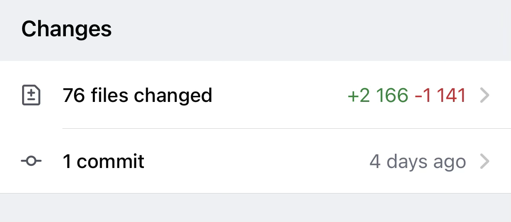

React recently introduced a new compiler that can automatically optimize our
components. This means no more sprinkling `useMemo` and `useCallback` everywhere
🎉 (but not in all cases). Let’s see what problems it solves in practice.

## Manual optimization

Firstly, here’s an example that I like to go through on an interview to gauge how
knowledgeable the candidate is with React performance hooks:

```jsx
function TodoList({ visibility, themeColor }) {
  const [todos, setTodos] = useState(initialTodos);
  const handleChange = (todo) => setTodos((todos) => getUpdated(todos, todo));
  const filtered = todos.filter((todo) => todo.category === visibility);

  return (
    <div>
      <ul>
        {filtered.map((todo, index) => (
          <Todo key={index} todo={todo} onChange={handleChange} />
        ))}
      </ul>
      <AddTodo setTodos={setTodos} themeColor={themeColor} />
    </div>
  );
}
```

This component is pretty straightforward, and there are a couple of optimizations
that we can add.

### useMemo

And the first one is `useMemo`. This hook is intended for caching **data** to
avoid re-computing it on every render.

We can wrap the filter with it:

```js
const filtered = useMemo(
  () => todos.filter((todo) => todo.category === visibility),
  [todos, visibility],
);
```

After adding it, when an unrelated piece of state changes, for example, `themeColor`,
this piece of state won’t be recomputed, but returned from cache instead. It will
only change when one of the dependencies changes. But that’s only the first part.
To ensure that `<Todo />` components aren't re-rendered unnecessarily, we also
need to take care of `handleChange` function, because it’s recreated on every render!

### useCallback

That’s exactly where this hook comes in: it allows us to cache **functions**.

```js
const handleChange = useCallback(
  (todo) => setTodos((todos) => getUpdated(todos, todo)),
  [],
);
```

The syntax of it is essentially the same: the first argument is the function
that we want to cache, and the second is an array of dependencies. In this case,
it’s empty because we've used the special form of set state with a callback.

### React.memo

But, turns out, it’s not enough. Even though all of the props passed to the
`<Todo />` component aren't changing, React is still re-rendering them.

To mitigate this, the component itself needs to be memoized:

```js
const TodoMemoized = React.memo(Todo);
```

`React.memo` is a higher-order component that wraps a component, and by comparing
previous and new props decides whether to re-render the component or not.

Here's what the manual optimization approach looks like after applying all of the
optimizations:

```jsx
const TodoMemoized = React.memo(Todo);

function TodoList({ visibility, themeColor }) {
  const [todos, setTodos] = useState(initialTodos);

  const handleChange = useCallback(
    (todo) => setTodos((todos) => getUpdated(todos, todo)),
    [],
  );

  const filtered = useMemo(
    () => todos.filter((todo) => todo.category === visibility),
    [todos, visibility],
  );

  return (
    <div>
      <ul>
        {filtered.map((todo, index) => (
          <TodoMemoized key={index} todo={todo} onChange={handleChange} />
        ))}
      </ul>
      <AddTodo setTodos={setTodos} themeColor={themeColor} />
    </div>
  );
}
```

## Compiler

Let’s rewind to the first example. Turns out all of the optimizations we've just
discussed now can be applied automatically!


Here’s a playground with this example:

[React Compiler optimized](https://playground.react.dev/#N4Igzg9grgTgxgUxALhAMygOzgFwJYSYAEAKhACYQAyeYOAFMEQG614BGeANnjgJ4AaIjgAWCALYIAwhC4QYRAL4BKIsAA6xInEJ0iAbRwUIYIWAQ4ylMAF0iAXiJRzAZRwBDHAnp5MvPO5cVibKANyaRNq6OEQi7pjkXNJxmADmCA7Cxg4AfETmlsZg9EbWuUTpOACqAA7kngjkJUVCpRDKYRFRmHpo3F4wjZltYAB0fVwDzZTlbaNwDanyfA72jqxgHNy8fJ2YXYM4sMT0XZEAPOR4zDlnkUTnUFy3Wvf3wBMDjaPi7jX00wgQl85AQAA9VPY8qdXm97udgkQANYIPj2YAg8GKLKUdFtbGEKQpdLolKJZLxdLYgD0Lzh9w6ijuF2pTzpcPOAEFyOREQVgmB0fyitjRBJpLJ5HixJIZHIYDT2SyrjcuntFCABCAdJg+qkUCA8OIavIYvwahkmAAFLhQVK+ADyNXwuiURDQMAg4iIAHJ2O52AguABaGq2+2YYODdy4YM6Y3cBAwalXOg+8L7TCMLrU6nxmrcTwETAAWQoCGQRHUIECXGrmmxYCLYD6CDARBtdsdzuLYDCmvAIggAHcAJKYAaYQJgFBoacIRRAA)

I appreciate how effortless the setup was: I just had to install the Babel plugin
and enable it in the configuration. I've also added updated ESLint rules for React
hooks (which now include additional recommendations).

This is a remarkable achievement; now the code looks a lot more like the developer
intended - without all of the intricate details of memoization.

But also, manual optimizations are still needed in some cases. I've encountered
it when I've enabled the compiler for visualizations on my website. Even though
I've removed a couple of `useMemo` usages, I still had to leave the `useCallback`s
that were needed for maze generation. That’s because some functions were called
inside of the useEffect.

The React compiler doesn't make performance hooks obsolete — but it lets us focus
more on logic, less on micromanaging renders.

## Conclusion

I'm excited to install and try out this compiler on my project at work! Given how
easy the setup was for my blog, I’m hoping that it will be as easy on the "real"
project. The project at work is far more complex and much bigger, but I'll share
how it goes.


But only after I merge this monstrous PR to upgrade from React 17 to 18 😅
