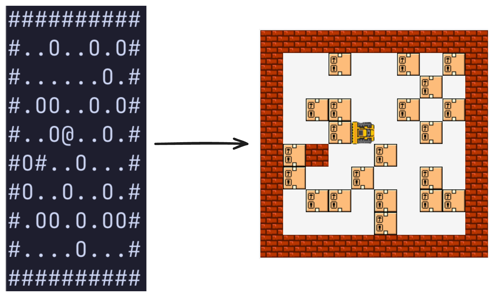

This blog post is inspired by the Advent of Code 2024 Day 15 puzzle: [Warehouse Woes](https://adventofcode.com/2024/day/15). I decided to build a simulation for it, and at the same time, challenge myself to not use any frameworks. Only HTML, CSS, JS, and drawing on a canvas! Well, almost. I decided to use TypeScript instead of JavaScript because it’s a bit easier to follow code with types, refactor code more confidently, and rely on the TS compiler to catch my mistakes. But other than that, my philosophy was simple: only hardcore, no frameworks 😉

Surprisingly, it was such a breath of fresh air, compared to working with React and doing the same boring enterprise development every day. So, here’s the walkthrough of how I did it. One note before we start, though, I will be omitting non-important bits of the code, but you can always take a look at the full source code in the [repository](https://github.com/chornonoh-vova/warehouse-simulator).

## Setup

Let’s start with the basics: in the `index.html` file, I have a simple layout:

```html
<!doctype html>
<html lang="en">
  <head>
    <meta charset="UTF-8" />
    <meta name="viewport" content="width=device-width, initial-scale=1.0" />
    <title>Warehouse Simulator</title>
  </head>
  <body>
    <main>
      <h1>Warehouse Simulator</h1>
      <div id="root">
        <div class="warehouse-wrapper">
          <canvas id="warehouse"></canvas>
        </div>
        <div id="mobile-controls" class="controls">
          <button id="left" class="button">&larr;</button>
          <button id="up" class="button">&uarr;</button>
          <button id="down" class="button">&darr;</button>
          <button id="right" class="button">&rarr;</button>
        </div>
        <div class="controls">
          <input id="map" name="map" type="file" accept="text/plain" hidden />
          <button id="upload" class="button">Upload</button>
          <button id="reset" class="button" style="background-color: #9f7db1;">
            Reset
          </button>
          <button
            id="help-btn"
            class="button"
            style="background-color: #38667f;"
          >
            Help
          </button>
        </div>
      </div>

      <dialog id="help-modal" closedby="any">
        <button class="close" autofocus>Close</button>
        <h2>
          Welcome to the warehouse simulator based on Advent Of Code 2024
          puzzle!
        </h2>
        <a href="https://adventofcode.com/2024/day/15"
          >Day 15: Warehouse Woes</a
        >

        <p>
          You can control a bulldozer via keyboard (on desktop) or with buttons
          (mobile) and move boxes and/or containers around
        </p>

        <h3>Controls (desktop):</h3>

        <ul>
          <li>
            Up: press <kbd>&uarr;</kbd>, <kbd>w</kbd> or <kbd>k</kbd> button
          </li>
          <li>
            Left: press <kbd>&larr;</kbd>, <kbd>a</kbd> or <kbd>h</kbd> button
          </li>
          <li>
            Down: press <kbd>&darr;</kbd>, <kbd>s</kbd> or <kbd>j</kbd> button
          </li>
          <li>
            Right: press <kbd>&rarr;</kbd>, <kbd>d</kbd> or <kbd>l</kbd> button
          </li>
        </ul>

        <p>
          You can also <kbd>Upload</kbd> txt file with input from puzzle and
          play around with that!
        </p>

        <p>
          At any point, click <kbd>Reset</kbd> to restore original map that
          you've uploaded
        </p>
      </dialog>
    </main>
    <script type="module" src="/src/main.ts"></script>
  </body>
</html>
```

The main thing in it is our canvas, on which I’ll draw all of the simulation. You can notice that it has no width and height specified, but I decided to make the canvas responsive, so the script will be responsible for setting this up.

I've also decided to try out native [`<dialog>`](https://developer.mozilla.org/en-US/docs/Web/HTML/Reference/Elements/dialog) HTML element. In my day-to-day work I'm always utilizing some library to get this functionality for me, and I always thought that modals in HTML were hard to implement. Turns out, I was very wrong! Native HTML dialog is so easy to use, it's widely supported by browsers (its part of the baseline now), and the fact that it doesn't add up to you JS bundle is just a chef's kiss 🧑‍🍳. Later in the post I'll show a usage of it.

I also used a lesser-known HTML element for the help content: [`<kbd>`](https://developer.mozilla.org/en-US/docs/Web/HTML/Reference/Elements/kbd), which semantically represents keyboard input and enhances accessibility.

Here’s a breakdown of the styles for the page:

```css
:root {
  --background-color-light: oklch(97% 0 0);
  --background-color-dark: oklch(14.5% 0 0);
  --background-color: var(--background-color-light);

  --border-color-light: oklch(20.5% 0 0);
  --border-color-dark: oklch(87% 0 0);
  --border-color: var(--border-color-light);

  --text-color-light: black;
  --text-color-dark: white;
  --text-color: var(--text-color-light);
}

@media (prefers-color-scheme: dark) {
  :root {
    --border-color: var(--border-color-dark);
    --background-color: var(--background-color-dark);
    --text-color: var(--text-color-dark);
  }
}

@font-face {
  font-family: "Pixelify Sans";
  src: url("PixelifySans-Regular.woff2") format("woff2");
}

body {
  width: 100vw;
  height: 100vh;
  background-color: var(--background-color);
  font-family: "Pixelify Sans", system-ui;
  color: var(--text-color);
}

/* ... */

#warehouse {
  width: 100%;
  height: 60vh;
  image-rendering: pixelated;
}

#mobile-controls {
  display: none;
}

/* ... */

.button {
  --shadow-color: color-mix(in oklch, var(--border-color) 30%, transparent);
  color: var(--text-color-dark);
  background-color: #009688;
  padding: 16px 32px;
  font-size: 1.5rem;
  box-shadow:
    0px 5px var(--border-color),
    0px -5px var(--border-color),
    5px 0px var(--border-color),
    -5px 0px var(--border-color),
    0px 10px var(--shadow-color),
    5px 5px var(--shadow-color),
    -5px 5px var(--shadow-color),
    inset 0px 5px #ffffff36;
}

.button:active {
  transform: translateY(5px);
  box-shadow:
    0px 5px var(--border-color),
    0px -5px var(--border-color),
    5px 0px var(--border-color),
    -5px 0px var(--border-color),
    inset 0px 5px var(--shadow-color);
}

/* ... */

@media (width < 768px) {
  /* ... */
  #mobile-controls {
    display: flex;
  }
  /* ... */
}
```

The main thing to note here is the sizing of the canvas. The width is set to 100%, and the height is set to 60vh (CSS unit to specify vertical height).

Other interesting things are:

- hiding the mobile controls on the desktop (with `display: none`) because I wanted to make desktop controls entirely from the keyboard
- CSS variables usage for colors to have a nice adaptation to the preferred color scheme of the user’s device
- using [`box-shadow`](https://developer.mozilla.org/en-US/docs/Web/CSS/box-shadow) to achieve pixelated borders effect for buttons and the canvas itself
- using [`color-mix()`](https://developer.mozilla.org/en-US/docs/Web/CSS/color_value/color-mix) function to add transparency to already existing color

Let’s now take a look at the renderer setup:

```typescript
const canvas = document.getElementById("warehouse")! as HTMLCanvasElement;
const ctx = canvas.getContext("2d")!;

function resize() {
  const { width, height } = canvas.getBoundingClientRect();
  const scale = window.devicePixelRatio;

  canvas.width = Math.floor(width * scale);
  canvas.height = Math.floor(height * scale);

  ctx.setTransform(1, 0, 0, 1, 0, 0);
  ctx.scale(scale, scale);
}

function render() {
  // ...
  requestAnimationFrame(render);
}

// ...

window.addEventListener("resize", resize);

requestAnimationFrame(() => {
  resize();
  render();
});
```

In the `resize` function, I’m setting up the _width_ and _height_ of the canvas depending on the measured client rect of the element. I followed the best practices on MDN about [device pixel ratio](https://developer.mozilla.org/en-US/docs/Web/API/Window/devicePixelRatio). I’m setting up the render loop by calling the `render` function first, and then deferring the next call via `requestAnimationFrame`. Rendering of the entities will be covered later.

Here's the whole setup to use `<dialog>`, that we discussed before:

```typescript
const helpDialog = document.getElementById("help-modal")! as HTMLDialogElement;

document.getElementById("help-btn")?.addEventListener("click", () => {
  helpDialog.showModal();
});

document.querySelectorAll(".close").forEach((btn) => {
  btn.addEventListener("click", () => {
    (btn.parentElement as HTMLDialogElement).close();
  });
});
```

## Puzzle: part 1

Now, let's go through the puzzle itself and how I'm displaying the entities on the canvas.

Map of the warehouse looks like this:

```text
##########
#..O..O.O#
#......O.#
#.OO..O.O#
#..O@..O.#
#O#..O...#
#O..O..O.#
#.OO.O.OO#
#....O...#
##########
```

Where `#` symbol denotes a wall, `O` symbol denotes a box, that can be moved, and `@` symbol denotes a starting position of the robot. I will be using bulldozer instead, because I liked pixel art that I've drawn for it quite a bit more. Original puzzle also includes a sequence of moves, but I'll be ignoring that, because I want to allow the user to freely move around the warehouse and move boxes.

The main rule is that bulldozer can move one or more boxes as long as it's not limited by a wall. I will be encoding this rule later, but now let's focus on parsing the warehouse map and drawing our entities.

```typescript
export class Warehouse {
  width: number;
  height: number;

  walls: Set<PositionHash>;
  boxes: Set<PositionHash>;

  bulldozer: {
    position: Position;
    direction: Direction;
  };

  constructor(map: string) {
    const tiles = map
      .trim()
      .split("\n")
      .filter((l) => l.startsWith("#") && l.endsWith("#"))
      .map((l) => l.split(""));

    this.height = tiles.length;
    this.width = tiles[0].length;

    this.walls = new Set();
    this.boxes = new Set();

    let bulldozerPosition = { row: 0, col: 0 };

    for (let row = 0; row < this.height; ++row) {
      for (let col = 0; col < this.width; ++col) {
        const tile = tiles[row][col];
        const position = { row, col };
        const positionHash = getPositionHash(position);
        switch (tile) {
          case "#": {
            this.walls.add(positionHash);
            break;
          }
          case "O": {
            this.boxes.add(positionHash);
            break;
          }
          case "@": {
            bulldozerPosition = position;
            break;
          }
        }
      }
    }

    this.bulldozer = {
      position: bulldozerPosition,
      direction: DIRECTIONS[3],
    };
  }
}
```

This class contains information about the warehouse, and I've setup parsing of the map in the constructor. I chose to use JS Set to store the positions of walls and boxes, but I encountered a limitation here. My position is represented by an object, and when storing objects event with the same properties, they are treated by JS as different (because they are compared by reference instead of value). That's why I store position hashes in the Set instead. Let's take a look at the position:

```typescript
export type Position = {
  row: number;
  col: number;
};

export type Direction = readonly [number, number];

export type PositionHash = `${number}:${number}`;

export function getPositionHash({ row, col }: Position): PositionHash {
  return `${row}:${col}`;
}

export function getNextPosition(
  { row, col }: Position,
  [dr, dc]: Direction,
): Position {
  return { row: row + dr, col: col + dc };
}
```

Hash of the position is pretty simple: it's just a string that contains two numbers (row and column), delimited by `:`. But that structure allows us positions in a Set and maintain uniqueness.

There's also a reference to directions, and they are specified just like in my other [blog post](/blog/flood-fill-algorithm#boundaries):

```typescript
const WASD = ["w", "d", "s", "a"];
const HJKL = ["k", "l", "j", "h"];
const ARROWS = ["ArrowUp", "ArrowRight", "ArrowDown", "ArrowLeft"];

export const ALL_KEYS = [...WASD, ...HJKL, ...ARROWS];

export const DIRECTIONS = [
  [-1, 0], // Up
  [0, 1], // Right
  [1, 0], // Down
  [0, -1], // Left
] as const;

export const TILE_SIZE = 32;

export const exampleMap =
  "##########\n" +
  "#..O..O.O#\n" +
  "#......O.#\n" +
  "#.OO..O.O#\n" +
  "#..O@..O.#\n" +
  "#O#..O...#\n" +
  "#O..O..O.#\n" +
  "#.OO.O.OO#\n" +
  "#....O...#\n" +
  "##########\n";
```

These are the shared constants that define various aspects of the simulation, like keyboard keys that can control bulldozer, directions, pixel size of tile, and a starting map.

With the warehouse state parsed and stored, we can now visualize it. Here's how rendering works using the canvas.

```typescript
function render() {
  const scale = window.devicePixelRatio;
  const canvasWidth = Math.floor(canvas.width / scale);
  const canvasHeight = Math.floor(canvas.height / scale);

  const warehouseWidth = warehouse.width * TILE_SIZE;
  const warehouseHeight = warehouse.height * TILE_SIZE;

  const bulldozerX = warehouse.bulldozer.position.col * 2 * TILE_SIZE;
  const bulldozerY = warehouse.bulldozer.position.row * 2 * TILE_SIZE;

  let offsetX = (canvasWidth - warehouseWidth) / 2;
  let offsetY = (canvasHeight - warehouseHeight) / 2;

  if (offsetX < 0) {
    const offsetMinX = canvasWidth - warehouseWidth;
    offsetX = clamp((canvasWidth - bulldozerX) / 2, offsetMinX, 0);
  }

  if (offsetY < 0) {
    const offsetMinY = canvasHeight - warehouseHeight;
    offsetY = clamp((canvasHeight - bulldozerY) / 2, offsetMinY, 0);
  }

  ctx.clearRect(0, 0, canvasWidth, canvasHeight);

  for (let row = 0; row < warehouse.height; ++row) {
    for (let col = 0; col < warehouse.width; ++col) {
      const tilePositionHash = getPositionHash({ row, col });
      const x = Math.floor(offsetX + col * TILE_SIZE);
      const y = Math.floor(offsetY + row * TILE_SIZE);

      if (warehouse.walls.has(tilePositionHash)) {
        drawWall(ctx, x, y);
      } else if (warehouse.boxes.has(tilePositionHash)) {
        drawBox(ctx, x, y);
      }
    }
  }

  drawBulldozer(
    ctx,
    offsetX + warehouse.bulldozer.position.col * TILE_SIZE,
    offsetY + warehouse.bulldozer.position.row * TILE_SIZE,
    warehouse.bulldozer.direction,
  );

  requestAnimationFrame(render);
}
```

The most important thing here is the calculation of the `offsetX` and `offsetY` values, they are needed to properly draw our entities. There are two distinct cases: when canvas width is greater than warehouse width and vice versa. In the first case, I'm just placing warehouse at the center of the canvas, but in the second case, I'm making sure that bulldozer is always in view.

Here's an implementation of a simple `clamp` function, which is used in the renderer to limit the offset values between min and max values:

```typescript
export function clamp(value: number, min: number, max: number): number {
  return Math.min(Math.max(value, min), max);
}
```

Let's now take a look at functions that draw individual entities:

```typescript
const wall = new Image(TILE_SIZE, TILE_SIZE);
wall.src = "/Wall.png";

export function drawWall(ctx: CanvasRenderingContext2D, x: number, y: number) {
  ctx.drawImage(wall, x, y, TILE_SIZE, TILE_SIZE);
}

const box = new Image(TILE_SIZE, TILE_SIZE);
box.src = "/Box.png";

export function drawBox(ctx: CanvasRenderingContext2D, x: number, y: number) {
  ctx.drawImage(box, x, y, TILE_SIZE, TILE_SIZE);
}

const bulldozer = new Image(TILE_SIZE, TILE_SIZE);
bulldozer.src = "/Bulldozer.png";

export function drawBulldozer(
  ctx: CanvasRenderingContext2D,
  x: number,
  y: number,
  [dr, dc]: Direction,
) {
  if (dc === 0) {
    ctx.save();
    if (dr == -1) {
      ctx.translate(x + TILE_SIZE, y);
      ctx.rotate(Math.PI / 2);
    } else {
      ctx.translate(x, y + TILE_SIZE);
      ctx.rotate(-(Math.PI / 2));
    }
    ctx.drawImage(bulldozer, 0, 0, TILE_SIZE, TILE_SIZE);
    ctx.restore();
  } else {
    if (dc === 1) {
      ctx.save();
      ctx.translate(x + TILE_SIZE, y);
      ctx.scale(-1, 1);
      ctx.drawImage(bulldozer, 0, 0, TILE_SIZE, TILE_SIZE);
      ctx.restore();
    } else {
      ctx.drawImage(bulldozer, x, y, TILE_SIZE, TILE_SIZE);
    }
  }
}

await Promise.all(
  [wall, box, bulldozer].map((img) => {
    return new Promise((resolve) => {
      img.onload = resolve;
    });
  }),
);
```

Images of the walls and boxes are drawn as-is, but bulldozer drawing is a little bit involved, because it needs to react to the direction in which bulldozer is driving. In the case of Up and Down direction, I'm rotating an image by +90° of -90° respectively. But it's also applying translation by X or Y so the image stays in the same place. In the case of Right direction, I'm mirroring image vertically, for which I also need to translate by X so the image stays in the same place. Left direction is default, so in this case, it's just a simple `drawImage` call.

## Adding interactivity

Here's how to set up custom map upload:

```typescript
let uploadedMap: string | undefined;

// ...

document.getElementById("upload")?.addEventListener("click", () => {
  mapInput.click();
});

mapInput.addEventListener("change", async () => {
  const file = mapInput.files?.[0];

  if (!file) {
    return;
  }

  const map = await file.text();

  uploadedMap = map;

  warehouse = new Warehouse(uploadedMap);
});

// ...

document.getElementById("reset")?.addEventListener("click", () => {
  warehouse = new Warehouse(uploadedMap ?? exampleMap);
});
```

Let's now take a look at implementing bulldozer movement. The first step is to add the logic to the `Warehouse` class:

```typescript
class Warehouse {
  // ...

  moveBulldozer(direction: Direction) {
    const nextPosition = getNextPosition(this.bulldozer.position, direction);
    const nextPositionHash = getPositionHash(nextPosition);

    if (this.boxes.has(nextPositionHash)) {
      if (this.canMoveBox(nextPosition, direction)) {
        this.moveBox(nextPosition, direction);
        this.bulldozer.position = nextPosition;
      }
    } else if (!this.walls.has(nextPositionHash)) {
      this.bulldozer.position = nextPosition;
    }
  }

  private canMoveBox(boxPosition: Position, direction: Direction): boolean {
    const nextBoxPosition = getNextPosition(boxPosition, direction);
    const nextBoxPositionHash = getPositionHash(nextBoxPosition);

    if (this.boxes.has(nextBoxPositionHash)) {
      return this.canMoveBox(nextBoxPosition, direction);
    } else {
      return !this.walls.has(nextBoxPositionHash);
    }
  }

  private moveBox(boxPosition: Position, direction: Direction) {
    const nextBoxPosition = getNextPosition(boxPosition, direction);
    const nextBoxPositionHash = getPositionHash(nextBoxPosition);

    if (this.boxes.has(nextBoxPositionHash)) {
      this.moveBox(nextBoxPosition, direction);
    }

    this.boxes.delete(getPositionHash(boxPosition));
    this.boxes.add(nextBoxPositionHash);
  }
}
```

The logic is as follows:

- when trying to move the bulldozer, we first check is the next position is a box
- if it is a box, we look whether we can move the box
  - `canMoveBox` recursively checks whether then next box can be moved, and returns false if next position hits a wall
  - finally, after we found out that box can be moved, we move the box and bulldozer after it
- if it is not a box, we check if it's not a wall, and we move a bulldozer only in this case

Here's how keyboard and button controls are set up:

```typescript
document.addEventListener(
  "keydown",
  (event) => {
    const key = event.key;

    if (!ALL_KEYS.includes(key)) {
      return;
    }

    const direction = DIRECTIONS[ALL_KEYS.indexOf(key) % 4];
    warehouse.bulldozer.direction = direction;
    warehouse.moveBulldozer(direction);
  },
  { passive: true },
);

const mapInput = document.getElementById("map")! as HTMLInputElement;

[
  document.getElementById("up"),
  document.getElementById("right"),
  document.getElementById("down"),
  document.getElementById("left"),
].forEach((btn, idx) => {
  btn?.addEventListener("click", (event) => {
    event.preventDefault();
    const direction = DIRECTIONS[idx];
    warehouse.bulldozer.direction = direction;
    warehouse.moveBulldozer(direction);
  });
});
```

I placed `ALL_KEYS` in an array in such a way, that key for moving up is placed first, right - second, down - third, left - fourth. So to get the direction to move (and `DIRECTIONS` array is structured in the same way) we can get the index and modulo it by 4. In the case of buttons, to not repeat the same `addEventListener`, I've added all of the buttons in the array, in the same order as `DIRECTIONS` and index of a button is just an index of the direction.

## Wrapping up Part 1

That's pretty much it about this simulation. Here's how it looks like:



I've decided to split the simulation into 2 parts (just like the original puzzle is split into 2 parts). So stay tuned for a part 2, where I'll implement the rest of the moving logic, new entity type - container, and its rendering. And, I'll publish a playable version - so you can play it from your browser!
